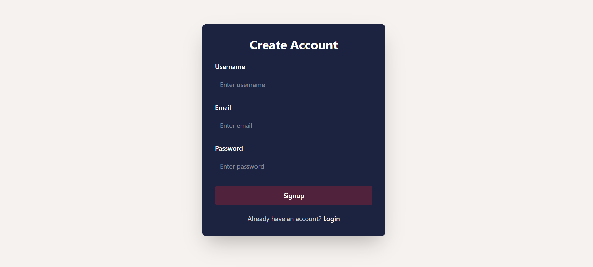
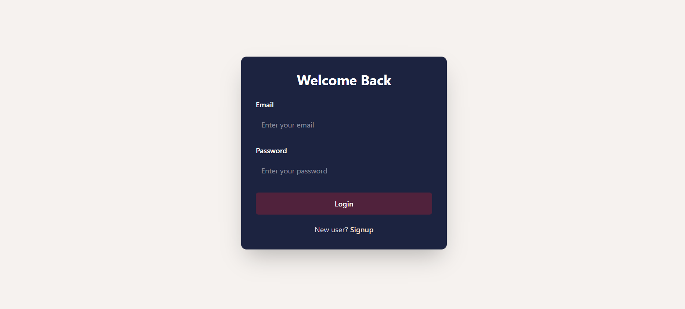
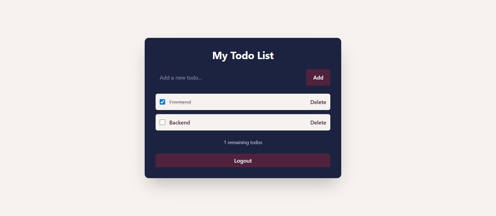

# MERN Todo App


A full-stack Todo application built with the **MERN stack (MongoDB, Express, React, Node.js)**.

Users can sign up, log in, and manage their personal todos securely using **JWT-based authentication**.

Built with a focus on clean architecture, scalable backend design, and production-style authentication flow.

---

## Live Demo

Frontend:
https://mern-todo-app-ten-beta.vercel.app/

Backend API:
https://todo-backend-uzxl.onrender.com

---

## Features

### Authentication

* User signup and login
* JWT authentication using Bearer token
* Token stored in localStorage
* Protected routes using middleware
* Axios interceptor support

### Todo Management

* Create todos
* Fetch all user-specific todos
* Mark todos as completed
* Delete todos
* Real-time UI updates

### UI/UX

* Clean modern UI (Tailwind CSS)
* Responsive layout
* Loading states
* Error handling
* Empty state handling
* 404 Page

---

## Screenshots

### Signup Page



### Login Page



### Todo Dashboard



---

## Tech Stack

### Frontend

* React (Vite)
* React Router
* Axios
* Tailwind CSS
* React Hot Toast

### Backend

* Node.js
* Express.js
* MongoDB (Mongoose)
* JSON Web Token (JWT)
* Bcrypt.js
* Zod (validation)

### Deployment

* Frontend: Vercel
* Backend: Render
* Database: MongoDB Atlas

---

## Project Structure

```
todo-app
│
├── backend
│   ├── controller
│   ├── model
│   ├── routes
│   ├── middleware
│   ├── jwt
│   └── index.js
│
├── frontend
│   ├── src
│   │   ├── components
│   │   │   ├── Home.jsx
│   │   │   ├── Login.jsx
│   │   │   ├── Signup.jsx
│   │   │   └── PageNotFound.jsx
│   │   ├── api
│   │   ├── App.jsx
│   │   └── main.jsx
```

---

## API Endpoints

### Auth Routes

| Method | Endpoint     | Description       |
| ------ | ------------ | ----------------- |
| POST   | /user/signup | Register new user |
| POST   | /user/login  | Login user        |
| POST   | /user/logout | Logout user       |

---

### Todo Routes (Protected)

| Method | Endpoint         | Description |
| ------ | ---------------- | ----------- |
| GET    | /todo/fetch      | Fetch todos |
| POST   | /todo/create     | Create todo |
| PUT    | /todo/update/:id | Update todo |
| DELETE | /todo/delete/:id | Delete todo |

---

## Authentication Flow

* User signs up or logs in

* Backend generates JWT token

* Token is returned to frontend

* Token is stored in `localStorage`

* For every request:

```
Authorization: Bearer <token>
```

* Backend middleware:

  * Verifies token
  * Extracts user ID
  * Grants access to protected routes

* Logout:

  * Removes token from localStorage

---

## Environment Variables

### Backend `.env`

```
PORT=4001
MONGODB_URI=your_mongodb_connection
JWT_SECRET_KEY=your_secret_key
NODE_ENV=production
```

---

## Installation

### Clone Repository

```
git clone https://github.com/amruta7974/mern-todo-app.git
```

---

### Backend Setup

```
cd backend
npm install
npm start
```

---

### Frontend Setup

```
cd frontend
npm install
npm run dev
```

---

## Available Scripts

### Backend

* npm start → run server

### Frontend

* npm run dev → start development server
* npm run build → production build
* npm run preview → preview build

---

## Important Notes

* Ensure MongoDB is running or Atlas URI is correct
* Do not commit `.env` file
* Update API base URL if backend changes
* Make sure token is sent in headers for protected routes

---

## Future Improvements

* Refresh token implementation
* Dark mode UI
* Drag & drop todos
* Search & filtering
* Due dates and reminders

---

## Author

Amruta Gaikwad

GitHub:
https://github.com/amruta7974

LinkedIn:
(https://www.linkedin.com/in/amruta-gaikwad-945302315/)

---

## License

This project is licensed under the MIT License.
